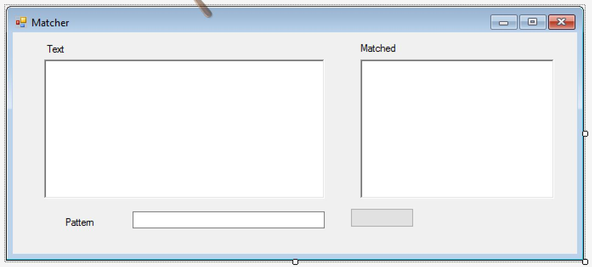
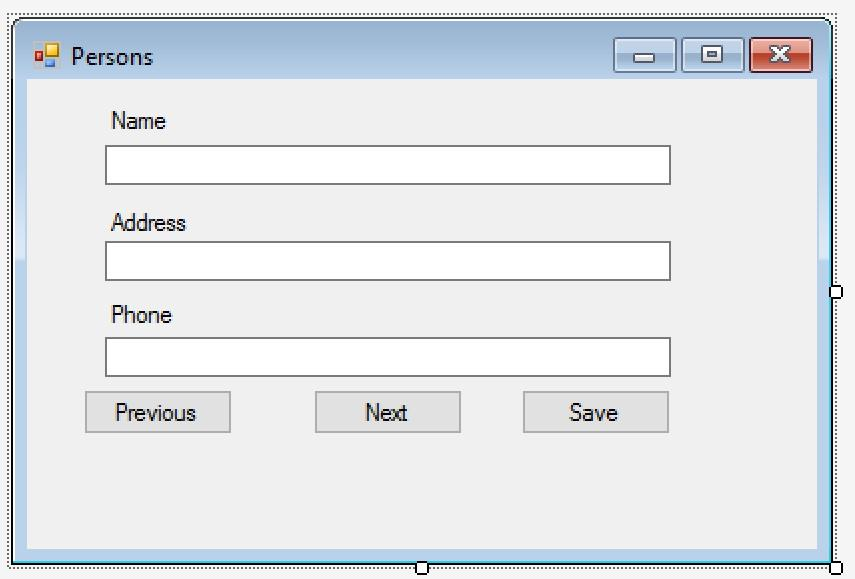

# CSharp_RegexSearch_Threadpool_Multithreading_Serializer_Week15B

<h2>Exercises in the subject of Regular Expressions, Serialization and Threading</h2>

In this week (Week15B) I got some exercises to solve in the above-mentioned topics. 
This repository contents four C# solutions.

<h4>Table of contents:</h4>

<dl>
	<dt><a href="#Multithreading">Multithreading</a></dt>
	<dd>Using the Thread Class to Demonstrate Multithreading.</dd>
	<dt><a href="#Regex">RegexSearch</a></dt>
	<dd>Searching in a text if it matches for a customizable regex pattern.</dd>
	<dt><a href="#Serializer">Serializer</a></dt>
	<dd>An application for serializing and deserializing Person objects.</dd>
	<dt><a href="#ThreadPool">ThreadPoolDemo</a></dt>
	<dd>Using the ThreadPool to Queue Work Items.</dd>
</dl>

<h3 id="Multithreading">Multithreading</h3>

In this exercise, I had to create a simple application that counts from 1 to 10 and shows each iteration in the console window.
It had to be a console application what can start two threads simultaneously.

<h3 id="Regex">RegexSearch</h3>

This project included a Windows Form application what contents a RichTextBox, a TextBox, a ListBox and a Button. In the RichTextBox, 
the user can write a text, and in the TextBox, he/she can write a regex pattern. After this, if the user click on the Button, the program checks
if there are any matches in the text for the pattern.

<h3 id="Serializer">Serializer</h3>

This project is a Windows Form application what can take three person data (name, address, phone) what the user can give on a form. 
If the user clicks on the 'Save' button, the program creates a Person object from the given data, and serialize it into a file.
The application also include a 'Previous' and a 'Next' button which make the previous or the next data of the saved persons appear in the fields 
after deserialization.

Here is the detailed description of this task:

<ol>
  <li>Prepare a category named 'Person', and the objects of it contains the names of persons, addresses, phone numbers, date of data recording and a serial number! Make the class to be saved (serialization) but the serial number should not be saved!</li>
  <li>Prepare the operation of clicking the 'Save' button that manages the operation, which saves the objectum of 'Person' - created by the data fields - into the file of personxx.dat (in which xx is the serial number of the person, and it can store 99 persons max.)</li>
  <li>At the start of the application the first person should be restored (deserialization) and its data should be appeared in the fields!</li>
  <li>Implement the IDeserializationCallback interface with the person class! Make the OnDeserialization() operation calculate the value of the serial number data member!</li>
  <li>Prepare the operations of clicking the 'Previous' and 'Next' buttons that manages the operations, which make the previous and the next data of the persons appear in the fields in accordance with the serial numbers.</li>
</ol>

<h3 id="ThreadPool">ThreadPoolDemo</h3>

In this exercise, I had to create an application that uses the thread pool to queue up methods to call on separate threads.
